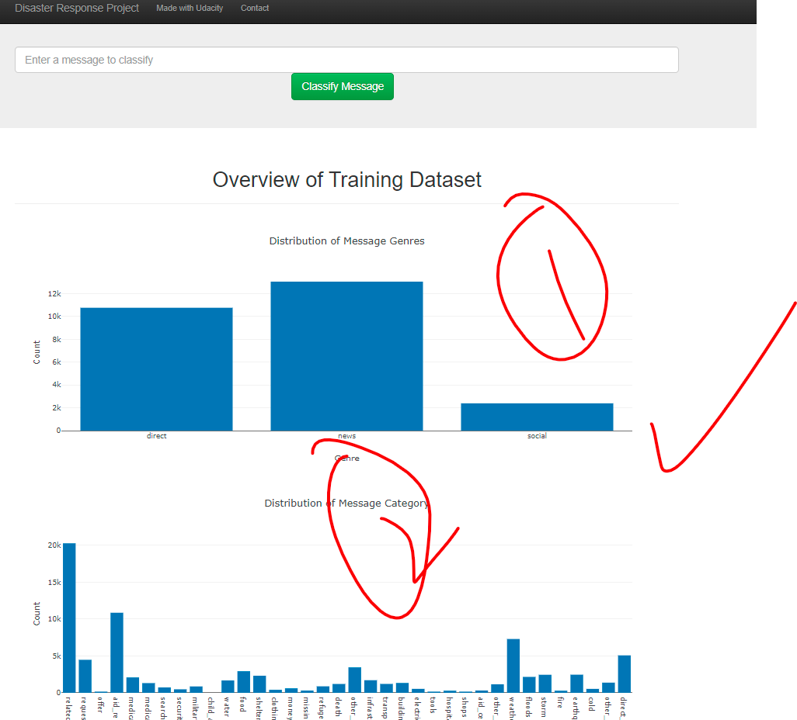
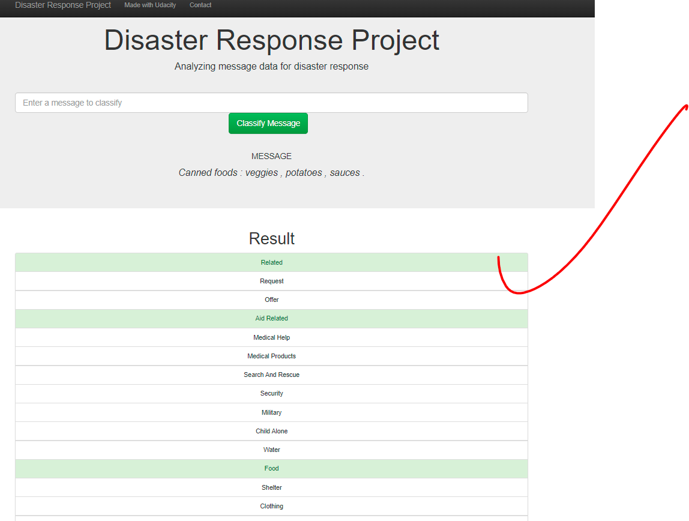

# Disaster Response Pipeline Project


### Motivation
This is the second project that I'm studying on Udacity. 
Figure Eight are providing pre-labeled tweets and text messages from real-life disasters.
I will apply data engineering skills to build ETL and Machine Learning pipelines to visualize data
and classify the given message into 36 categories.


### Installation
This project is built in Python using common packages such as `pandas`, `sklearn`, `nltk`, `flask`..
- Install Python:
Download the [Python](https://www.python.org/downloads/) official website
- Install the Python packages by command
```shell
pip install package-name
```
Replace package-name with a specified package such as `pandas`, `sklearn`, `nltk`, `flask`

### Instructions:
1. Run the following commands in the project's root directory to set up your database and model.

    - To run ETL pipeline that cleans data and stores it in database
        `python data/process_data.py data/disaster_messages.csv data/disaster_categories.csv data/DisasterResponse.db`
    - To run ML pipeline that trains classifier and saves
        `python models/train_classifier.py data/DisasterResponse.db models/classifier.pkl`

2. Run the following command in the app's directory to run your web app.
    `python run.py`

3. Go to http://0.0.0.0:3001/

### File description
```shell

- app
| - template
| |- master.html  # main page of web app
| |- go.html  # classification result page of web app
|- run.py  # Flask file that runs app

- data
|- disaster_categories.csv  # data to process 
|- disaster_messages.csv  # data to process
|- process_data.py
|- DisasterResponse.db   # database to save clean data to

- models
|- train_classifier.py
|- classifier.pkl  # saved model 

- README.md
```

### Results
- 98 / 5,000
Translation results
I display the collected and cleaned data in the form of graphs for visualization. There are 2 main charts

  
- When a user inputs a message into the app, the app returns classification results for all 36 categories


### Acknowledgments

Use this space to list resources you find helpful.

• [Disaster Response Pipeline with Figure Eight](https://simone-rigoni01.medium.com/disaster-response-pipeline-with-figure-eight-a0addd696352)

• [Disaster Response Message Classification Pipelines (NLTK & Flask)](https://katba-caroline.com/disaster-response-message-classification-pipelines-nltk-flask/)

• [Building a Disaster Response Web-Application](https://towardsdatascience.com/building-a-disaster-response-web-application-4066e6f90072)


